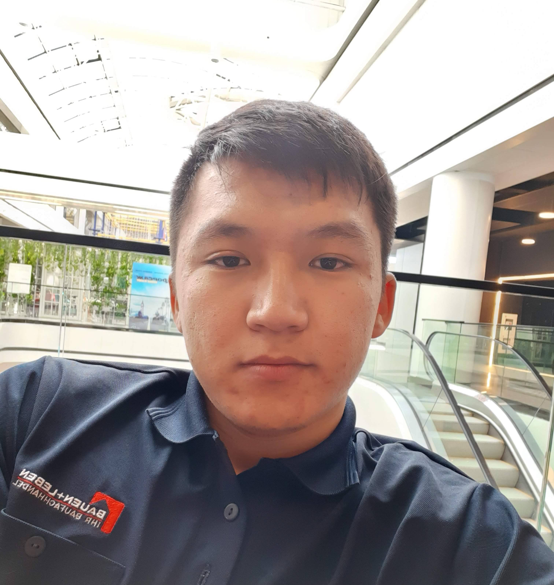

## *Шаршеев Нурсултан*



### Мои контакты: 
##### 1. Телефон, Telegram, WhatsApp: +996702640375
##### 2. E-mail: nursultan.sharsheev@gmail.com

### Обо мне:
#### *Год рождения : 1998*
#### *Всегда интересовался программированием и технологиями. В ближайшем будущем планирую вырасти до хорошего WEB программиста.*
### Мои навыки: 
#### *Знаю HTML5, CSS5, JS, React JS на базовом уровне. Умею работать с GitHub. Всегда готов обучаться и развивать свои навыки.*
### Пример кода:
```
 <div class="container">
        <div class="waxomis">
            <div class="col-lg-8 col-md-8 col-sm-8 col-8 offset-2 ">
                <h4 class="ideas-title">Our Latest Projects.</h4>
                <h6 class="waxomis-title">Investigationes demonstraverunt lectores legere me lius quod ii legunt
                    saepius. Claritas est etiam processus dynamicus, qui sequitur mutationem consuetudium.</h6>
            </div>
        </div>
    </div>
```
### Мои последние проекты: 
#### 1) [Waxom](https://sharsheevnursultan.github.io/waxom/) 
#### 2) [Spirit8](https://sharsheevnursultan.github.io/spirit8/)
#### 3) [JS Calculator](https://sharsheevnursultan.github.io/jscalc/)
#### 4) [Hexal](https://sharsheevnursultan.github.io/hexal/)
#### 5) [Todo List on React JS](https://sharsheevnursultan.github.io/todo-list/)
### Образование: 
#### Среднее образование. Учился на курсах It-run на Front-End разработчика.  Длительность обучения 6 месяцев начиная с апреля 2019 года.
###### *Свободно разговариваю на кыргызском и русском языке. Английским владею на уровне понимания текста.*
#### **Удачного дня!**
